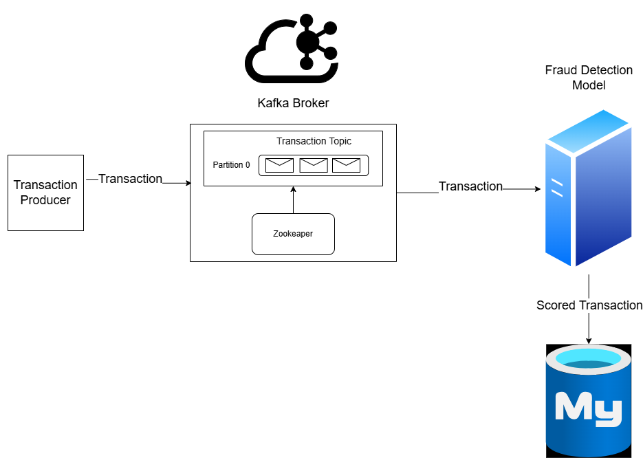

Here’s a detailed `README.md` based on the information you provided:

---

# Real-Time Payment Fraud Detection System


## Overview
This project is a **real-time payment scoring system** designed to detect potentially fraudulent transactions. It leverages the following technologies:  
- **Apache Kafka**: For real-time data streaming.  
- **Machine Learning Model**: A pre-trained model to classify transactions as fraudulent or not.  
- **MySQL**: To store the results of the fraud detection system.

The system simulates real-time transactions by producing data to a Kafka topic and consuming it to classify transactions. Fraudulent transactions are flagged and stored in a MySQL database.

---

## Features
1. Real-time transaction streaming using **Kafka**.
2. Fraud detection using a **pre-trained machine learning model**.
3. Results stored in a **MySQL database** for analysis.
4. Modular code for ease of testing and scalability.

---

## File Structure
### Directories and Files
- **`data/`**  
  Contains raw transaction data and test data for unit testing.  
  - `transactions.csv`: Transaction data used by the system.  
  - `test_transactions.csv`: Test data for unit testing.

- **`fraud_detection_system/`**  
  Core logic for fraud detection and data production.  
  - `fraud_detection_system.py`: Consumes transaction data from Kafka and classifies it using the ML model.  
  - `transaction_producer.py`: Produces transaction data from `transactions.csv` to a Kafka topic.  
  - `__init__.py`: Makes the directory a Python module.

- **`pre_trained_models/`**  
  Stores the machine learning model used for fraud detection.  
  - `nb_model.joblib`: A pre-trained Naive Bayes model.

- **`tests/`**  
  Contains unit tests for the system.  
  - `test_transaction_producer.py`: Tests the transaction producer functionality.  
  - `__init__.py`: Makes the directory a Python module.

- **`utils/`**  
  Helper scripts for database setup and other utility functions.  
  - `setup_mysql_db.py`: Sets up the MySQL database and creates the required table.  
  - `__init__.py`: Makes the directory a Python module.

- **`main.py`**  
  The entry point of the application. It initializes the system components and runs them in parallel using threads.

- **`Dockerfile`**  
  Defines the Docker image for the application.

- **`docker-compose.yaml`**  
  Sets up the entire application stack, including Kafka, Zookeeper, and MySQL, along with the application.

- **`requirements.txt`**  
  Lists the Python dependencies (if needed locally, but handled in Docker).

---

## Prerequisites
Ensure you have the following installed:  
- **Docker**  
- **Docker Compose**

---

## Getting Started
### Step 1: Clone the Repository
Clone this repository to your local machine:
```bash
git clone <repository-url>
cd <repository-folder>
```

### Step 2: Build and Run with Docker Compose
Build and start the application using Docker Compose:
```bash
docker-compose up --build
```

This will:
1. Set up Kafka, Zookeeper, and MySQL containers.
2. Build the application image and run the fraud detection system.

### Step 3: Verify the System
Once the system is running:
- Kafka will stream transaction data from `transactions.csv`.  
- The fraud detection model will classify transactions, storing results in the MySQL database.

---

## Notes
- **Time to see logs in docker**: You need to wait approximately 2 minutes to see the logs in the docker container because the system is running in parallel.
- **Environment Variables:** The system uses environment variables defined in the `docker-compose.yaml` to configure Kafka, MySQL, and the data/model paths and they're not variables because it's not a real project just for demo purposes.
- **Modifications:** You can replace `transactions.csv` with your own data or retrain the model if needed.


Feel free to suggest or contribute improvements!